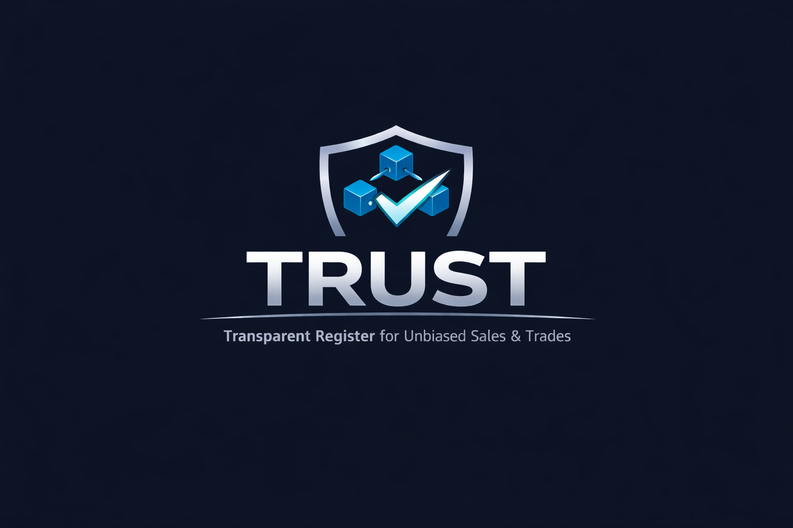

# TRUST — Transparent Register for Unbiased Sales & Trades
> Online auction platform that uses blockchain (smart contracts) to manage auction logic and ensure transparent bidding. Built with Python (Flask), Solidity, and PostgreSQL. Designed for security-minded users as an alternative to traditional auction platforms with stronger guarantees around transaction integrity and fraud prevention. We are developing this for security-minded individuals, as an alternative to auction houses that don't offer comprehensive fraud protection and security. This project will impact users by offering a safe place to shop and auction their personal items. Built by Nathan Carlson, Jorge Martinez-Lopez, Joseph Krabe, Kristian Parra, and Robert Krause.
> Live demo [_here_](https://www.example.com). <!-- If you have the project hosted somewhere, include the link here. -->

## Table of Contents
* [General Info](#general-information)
* [Technologies Used](#technologies-used)
* [Features](#features)
* [Screenshots](#screenshots)
* [Setup](#setup)
* [Usage](#usage)
* [Project Status](#project-status)
* [Room for Improvement](#room-for-improvement)
* [Acknowledgements](#acknowledgements)
* [Contact](#contact)
<!-- * [License](#license) -->


## General Information

- What problem does this application solve?
	- Reduced fraud and increased security when compared to alternatives (like ebay)
- Why did you undertake it?
	- We wanted to explore blockchain-based system design and demonstrate how smart contracts can increase trust in digital marketplaces
<!-- You don't have to answer all the questions - just the ones relevant to your project. -->


## Technologies Used
- Python (Flask) → backend server and API
- Solidity → smart contracts for auction logic
- Web3.py → blockchain interaction from backend
- PostgreSQL (Neon) → database for users, auctions, bids
- Hardhat → local Ethereum blockchain for development/testing
- HTML/CSS → frontend UI
- JSON-RPC → communication with blockchain


# Features

## Sprint 1

### Contributions

Jorge Martinez-Lopez: “Designed initial auction contract structure and implemented blockchain integration layer with structured backend error handling”

- Jira Task: Auction State Design (initial multi-auction architecture groundwork, architectural groundwork for next sprint)
	- PROJ-36 [Bitbucket](https://bitbucket.org/cs3398-bith-s26/trust/src/a44a2c7c1cfb36409e09086acf594c58e20fddc5/?at=Tasks%2FPROJ-36-auction-state-design)

- Jira Task: Auction Controller Integration Planning (architectural groundwork for next sprint)
	- PROJ-37, [Bitbucket](https://bitbucket.org/cs3398-bith-s26/trust/src/91e8af3c4d478af2b2f1bf94d7be3752af8a5c0d/?at=Tasks%2FPROJ-37-implement-solidity-getter-for-au)

- Jira Task: Flask to Smart Contract Integration
	- PROJ-38, [Bitbucket](https://bitbucket.org/cs3398-bith-s26/trust/src/d8ed5e963daf9e4c95d9a929763ca81311262a19/?at=feature%2FPROJ-38-update-python-client-json-rpc)

- Jira Task: Structured Backend Error Handling
	- PROJ-39, [Bitbucket](https://bitbucket.org/cs3398-bith-s26/trust/src/03e84149e38c17482358bb7d64f31036a41f5300/?at=feature%2FPROJ-39-backend-error-handling)

Kristian Parra: "Implemented user registration functionality including database schema, password hashing, email validation, and unit testing."

Jira Task: PROJ-49 – Design user database structure
- [Bitbucket](https://bitbucket.org/cs3398-bith-s26/trust/commits/branch/PROJ-49-user-database-structure)

Jira Task: PROJ-50 – Implement user registration function
- [Bitbucket](https://bitbucket.org/cs3398-bith-s26/trust/commits/branch/PROJ-50-user-registration)

Jira Task: PROJ-51 – Validate email input
- [Bitbucket](https://bitbucket.org/cs3398-bith-s26/trust/commits/branch/PROJ-51-validate-email-input)

Jira Task: PROJ-52 – Implement password hashing
- [Bitbucket](https://bitbucket.org/cs3398-bith-s26/trust/commits/branch/feature%2FPROJ-52-password-hashing)

Jira Task: PROJ-53 – Write unit tests for registration
- [Bitbucket](https://bitbucket.org/cs3398-bith-s26/trust/commits/branch/feature%2FPROJ-53-write-unit-tests-for-registration)

Robert Krause : "Created Hard local blockhain node, Created in chain auction logic, created remotes to interact with contract live on the blockchain from python layer"

Jira task: PROJ-5 - Set up local Hardhat node
- [Bitbucket](https://bitbucket.org/cs3398-bith-s26/trust/commits/843606e2b5b2703a6e505369f4c67feb97162de6)

Jira task: PROJ-6 Create base Solidity contract
- [Bitbucket](https://bitbucket.org/cs3398-bith-s26/trust/commits/9a3b941f96afc07ffc9fa440e0674346301fb8cc)

Jira task: PROJ-7 Design Auction data structure
- [Bitbucket](https://bitbucket.org/cs3398-bith-s26/trust/commits/9a3b941f96afc07ffc9fa440e0674346301fb8cc)

Jira task: PROJ-63 Export ABI for Pythonh
- [Bitbucket](https://bitbucket.org/cs3398-bith-s26/trust/commits/5c78482f52bd5d161ec3e4988968ec94924f70a0)

Jira task: PROJ-61 Create bidding.py
- [Bitbucket](https://bitbucket.org/cs3398-bith-s26/trust/commits/5c78482f52bd5d161ec3e4988968ec94924f70a0)

Jira task: PROJ-69 Create state.py
- [Bitbucket](https://bitbucket.org/cs3398-bith-s26/trust/commits/3460b36afa493b661a9caf395a47da5ec76ea0e6)
Report

Nathan: “Created local flask-powered web app that allows users to interact with active auctions”

- Jira Task: Foundational Architecture & Layout
	- [PROJ-71](https://cs3398-bith-s26new.atlassian.net/browse/PROJ-71)
	- [Bitbucket](https://bitbucket.org/cs3398-bith-s26/trust/branch/feature/PROJ-71-foundational-architecture-layout)

- Jira Task: Advanced Auction Gallery & Card Components
	- [PROJ-72](https://cs3398-bith-s26new.atlassian.net/browse/PROJ-72)
	- [Bitbucket](https://bitbucket.org/cs3398-bith-s26/trust/branch/feature/PROJ-72-advanced-auction-gallery-card-components)

- Jira Task: Auction Detail Page & Bidding Interface
	- [PROJ-73](https://cs3398-bith-s26new.atlassian.net/browse/PROJ-73)
	- [Bitbucket](https://bitbucket.org/cs3398-bith-s26/trust/branch/feature/PROJ-73-auction-detail-page-bidding-inte)


# Sprint 1 - Next Steps

#### Jorge Martinez-Lopez

- Refactor smart contract to support multiple simultaneous auctions
- Implement bid submission endpoint connecting Flask to on-chain placeBid
- Add integration tests validating full blockchain transaction flow

#### Kristian Parra
- Connect backend registration system to Jorge’s frontend interface
- Test full user registration flow from UI to database
- Fix any integration bugs between frontend and backend

#### Nathan Carlson
- Finish UI pages and polish
- Implement auction db
- Connect auction db to flask app
- Test database connections

## Sprint 2

### Contributions

Jorge Martinez-Lopez: “Implemented wallet-based user mapping and strengthened backend-blockchain integration for reliable local testing and demo execution.”

- Jira Task: Verify Local Contract Deployment and Wallet Configuration
	- PROJ-64 [Bitbucket](https://bitbucket.org/cs3398-bith-s26/trust/src/f6f05000759b3e3641b30baacd391b377c45ae07/?at=feature%2FPROJ-64-verify-wallet-and-contract-setupn)

- Jira Task: Integrate Local Test Wallets into User Flow
	- PROJ-65, [Bitbucket](https://bitbucket.org/cs3398-bith-s26/trust/src/20d9931de6aa4dbf4f4ca9ee115ac19f99b674a8/?at=feature%2FPROJ-65-local-test-wallet-flow)

- Jira Task: Modify state.py for Multiple Auctions Functionality 
	- PROJ-88, [Bitbucket](https://bitbucket.org/cs3398-bith-s26/trust/src/457288fa78b6266d74461a929476b7eef1560f12/?at=feature%2FPROJ-88-multi-auction-state)

- Jira Task: Auction State Integration & Cleanup
	- PROJ-89, [Bitbucket](https://bitbucket.org/cs3398-bith-s26/trust/src/a5666b75894014d022a9b43e2ae37e0d6fa340a5/?at=feature%2FPROJ-89-auction-state-integration)

- Jira Task: Add Readable Timestamps to Auction State
	- PROJ-92, [Bitbucket](https://bitbucket.org/cs3398-bith-s26/trust/src/f5690c3a9e4da9b946acfe27b7ed2ae243403008/?at=feature%2FPROJ-92-readable-auction-timestamps)

- Jira Task: Integrate Blockchain Auction State Using Auction IDs
	- PROJ-97, [Bitbucket](https://bitbucket.org/cs3398-bith-s26/trust/src/2ee7909f795a036de28616ab320a1c234c34db29/?at=feature%2FPROJ-97-auction-address-registry)

Nathan Carlson: "Set up database structure and logic for auctions/bids and implemented create/edit auction pages."

- Jira Task: Design and Implement SQL Schema for Auctions and Bids
	- PROJ-99, [Bitbucket](https://bitbucket.org/cs3398-bith-s26/%7Be38c57da-8fd4-47c5-b10e-a639dfbf9bee%7D/branch/feature/PROJ-99-design-and-implement-sql-schema-for-auctions-and-bids)
	- Pull request approved but not merged because I rebased it on main

- Jira Task: Develop Python CRUD Functions for Auction Management
	- PROJ-100, [Bitbucket](https://bitbucket.org/cs3398-bith-s26/%7Be38c57da-8fd4-47c5-b10e-a639dfbf9bee%7D/branch/feature/PROJ-100-develop-python-crud-functions-for-auction-management)

- Jira Task: Create Auction Submission Form and Image Upload Logic
	- PROJ-101, [Bitbucket](https://bitbucket.org/cs3398-bith-s26/%7Be38c57da-8fd4-47c5-b10e-a639dfbf9bee%7D/branch/feature/PROJ-101-create-auction-submission-form)

- Jira Task: Implement Auction Details and Edit View
	- PROJ-102, [Bitbucket](https://bitbucket.org/cs3398-bith-s26/%7Be38c57da-8fd4-47c5-b10e-a639dfbf9bee%7D/branch/feature/PROJ-102-implement-auction-details-and-edit-view)

- Jira Task: Create my auctions page
	- PROJ-103, [Bitbucket](https://bitbucket.org/cs3398-bith-s26/%7Be38c57da-8fd4-47c5-b10e-a639dfbf9bee%7D/branch/feature/PROJ-103-create-my-auctions-page)

# Sprint 2 - Next Steps

### Jorge Martinez-Lopez

- Improve visibility of blockchain-backed actions in the UI  
- Strengthen validation and error handling for auction and bidding flows  
- Add integration testing for full seller → bidder workflow  
- Improve reliability of local demo environment and startup process  
- Continue refining backend and blockchain coordination  

### Nathan Carlson

- Host flask app and mock blockchain on AWS
- Refactor project to follow SOLID Principles better
- Continue refining UI styling and web app features
- Unit test database code

## Sprint 3

### Contributions

Jorge Martinez-Lopez: “Integrated ETH to USD pricing into the backend using an external API, extended auction state handling for display-ready data, implemented backend unit tests using pytest, and contributed to refactoring efforts by aligning backend logic with the new service and routing structure.”

- Jira Task: Integrate ETH to USD API
	- PROJ-122 [Bitbucket](https://bitbucket.org/cs3398-bith-s26/trust/src/9b7a450df7fe5522e0a2d26eec927bc87d83c0f4/?at=feature%2FPROJ-122-integrate-eth-usd-api)

- Jira Task: Extend backend response to include USD value
	- PROJ-124, [Bitbucket](https://bitbucket.org/cs3398-bith-s26/trust/src/9cb0699411778d413821690f90efa1139b59f3b1/?at=feature%2FPROJ-124-extend-backend-response-usd)

- Jira Task: Add USD pricing display logic at the Flask layer with proper fallback handling
	- PROJ-125, [Bitbucket](https://bitbucket.org/cs3398-bith-s26/trust/src/f1236394c6730473ee41d52fea5add0d975c440d/?at=feature%2FPROJ-125-pricing-fallback-validation)

- Jira Task: Display user wallet balance after login
	- PROJ-133, [Bitbucket](https://bitbucket.org/cs3398-bith-s26/trust/src/db54e672a45857007d16a04f46cad755d15542a9/?at=feature%2FPROJ-133-display-wallet-balance)

- Jira Task: Change flask_app.py to follow SRP
	- PROJ-118, [Bitbucket](https://bitbucket.org/cs3398-bith-s26/trust/src/618e6180af0154e24935ce13b6e20dc1b1b9f5c9/?at=feature%2FPROJ-118-srp-refactor-flask-routes)

- Jira Task: Update backend tests for pricing integration behavior
	- PROJ-126, [Bitbucket](https://bitbucket.org/cs3398-bith-s26/trust/src/69b7c40f86caf434b3375e06242ffd7addcfd7a6/?at=feature%2FPROJ-126-backend-tests-pricing)

# Sprint 3 - Next Steps

### Jorge Martinez-Lopez

- Further standardize backend service responses to ensure consistent data contracts across routes and services  
- Expand backend test coverage to include repository and service layers  
- Improve error handling and validation across authentication and auction flows  
- Refine integration between backend services and external APIs (e.g., pricing)  
- Continue improving modular architecture between routes, services, and blockchain components  


## Screenshots

<!-- If you have screenshots you'd like to share, include them here. -->


## Setup

### Prerequisites
- Python 3.9+
- Node.js **v22+** (required for Hardhat compatibility)
- PostgreSQL (or Neon database)
- Git

### Installation

1. Clone the repository
```
git clone https://bitbucket.org/cs3398-bith-s26/trust.git
cd trust
```
2.	Set up Python virtual environment

```
python -m venv .venv
```

3. Activate Python virtual environment

```
# Mac/Linux
source .venv/bin/activate

# Windows (Command Prompt)
.venv\Scripts\activate

# Windows (PowerShell)
.venv\Scripts\Activate.ps1
```
4. Install dependencies

```
pip install -r requirements.txt
```

5. Set up environment variables

Create a `.env` file in the root directory of the project and add the following:

```
DATABASE_URL=your_database_connection_string
```

6. Run the application

```
python start_app.py
```

## Usage
How does one go about using it?
Provide various use cases and code examples here.

`write-your-code-here`


## Project Status
Project is: In Progress

## Room for Improvement
Include areas you believe need improvement / could be improved. Also add TODOs for future development.

Room for improvement:
- Improvement to be done 1
- Improvement to be done 2

To do:
- Feature to be added 1
- Feature to be added 2


## Acknowledgements
Give credit here.
- This project was inspired by...
- This project was based on [this tutorial](https://www.example.com).
- Many thanks to...


## Contact
Created by [@flynerdpl](https://www.flynerd.pl/) - feel free to contact me!


<!-- Optional -->
<!-- ## License -->
<!-- This project is open source and available under the [... License](). -->

<!-- You don't have to include all sections - just the one's relevant to your project -->